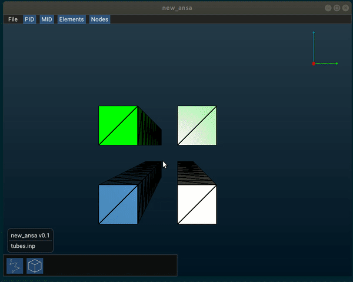

# About new_ansa
This program takes an ABAQUS input text file and displays the mesh. ABAQUS is a commercial FE-solver, and this program displays some of the thousands of available element types  in ABAQUS.

The name is a play on the charachter Yin Yan from the TV-show Silicon Valley, who has the app idea "New Netflix".

ANSA is a commercial software for viewing and editing FE-mesh files and this small project emulates some of its features and borrows some color schemes.. Please don't sue me.

## Features
- Reads a text file following the ABAQUS syntax and displays a visual representation of the mesh
- Zoom, drag and rotate model (arcball-style, as is typical in CAD-programs)
- Simple GUI to overview elements, nodes, materials
- "Single pass" wireframe on mesh

## Usage and demo
To run the example file "tubes.inp", on Linux enter:
``./new_ansa abaqus_examples/tubes.inp``

## TODO:
Makefile, otherwise the vscode project file should help. 

Feature edge detection

Support more element types

Catch input file errors

Fix camera object membership so it doesn't have to be global

etc.. sigh....

